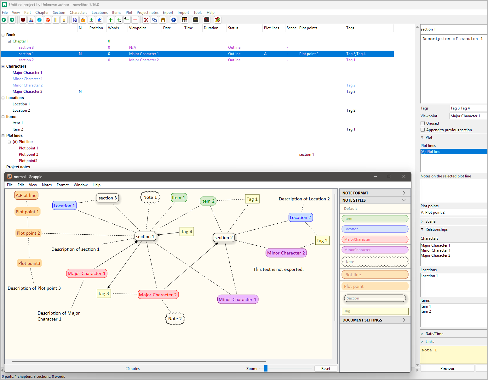

#  scap_novx

A Python script for creating new [novelibre](https://github.com/peter88213/novelibre/) projects from Scapple diagrams 

## Features

- Notes with a shadow are converted to sections in one single chapter.
- Notes with a "cloud" border without shadow are converted to element notes.
- Notes with a square border are converted to tags.
- Notes with colored text are converted to characters, locations, items, plot lines, or plot points.
- Connections between sections and characters/locations/items/plot lines/plot points are considered.
- If a novelibre project already exists, Character/Location/Item/Plot line XML files are generated instead.
- The *scap_novx* release includes a sample Scapple file with note styles to import.

 
## Requirements

- [Python](https://www.python.org/) version 3.7+.
- [Scapple 1.x](https://www.literatureandlatte.com/scapple/overview).

## Download and install

### Default: Executable Python zip archive

Download the latest release [scap_novx_v5.5.0.pyz](https://github.com/peter88213/scap_novx/raw/main/dist/scap_novx_v5.5.0.pyz)

- Launch *scap_novx_v5.5.0.pyz* by double-clicking (Windows desktop),
- or execute `python scap_novx_v5.5.0.pyz` (Windows), resp. `python3 scap_novx_v5.5.0.pyz` (Linux) on the command line.

> [!IMPORTANT]
> Many web browsers recognize the download as an executable file and offer to open it immediately. 
> This starts the installation under Windows.
> 
> However, depending on your security settings, your browser may 
> initially  refuse  to download the executable file. 
> In this case, your confirmation or an additional action is required. 
> If this is not possible, you have the option of downloading 
> the zip file. 

### Alternative: Zip file

The package is also available in zip format: [scap_novx_v5.5.0.zip](https://github.com/peter88213/scap_novx/raw/main/dist/scap_novx_v5.5.0.zip)

- Extract the *scap_novx_v5.5.0* folder from the downloaded zipfile "scap_novx_v5.5.0.zip".
- Move into this new folder and launch *setup.py* by double-clicking (Windows/Linux desktop), 
- or execute `python setup.py` (Windows), resp. `python3 setup.py` (Linux) on the command line.

### Note for Linux users

Please make sure that your Python3 installation has the *tkinter* module. On Ubuntu, for example, it is not available out of the box and must be installed via a separate package. 

------------------------------------------------------------------

[Changelog](docs/changelog.md)

## Usage

See the [online manual](https://peter88213.github.io/scap_novx/help/)

## License

This is Open Source software, and scap_novx is licensed under GPLv3. See the
[GNU General Public License website](https://www.gnu.org/licenses/gpl-3.0.en.html) for more
details, or consult the [LICENSE](https://github.com/peter88213/scap_novx/blob/main/LICENSE) file.

 

