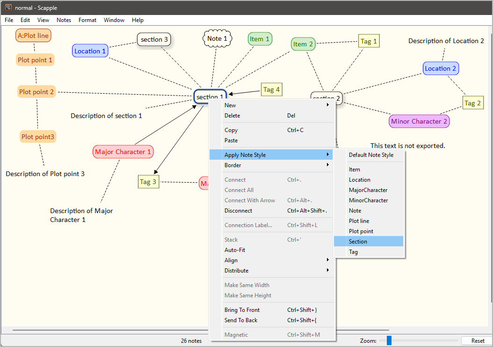
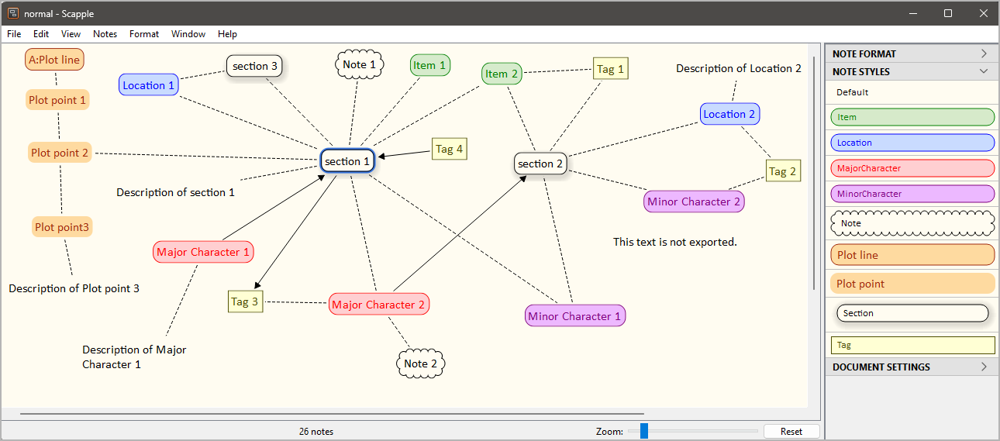

[Project homepage](https://github.com/peter88213/scap_novx) > [Index](../) > Help

[Deutsch](../help_de/)

------------------------------------------------------------------------

# User guide

This page refers to the latest
[scap_novx](https://github.com/peter88213/scap_novx/) release.

The scap_novx Python script creates a *novelibre* project from a Scapple
outline.

## Instructions for use

### Intended usage

The included installation script prompts you to create a shortcut on the
desktop. You can launch the program by dragging a *scap* file and
dropping it on the shortcut icon.

### Command line usage

Alternatively, you can

-   launch the program on the command line passing the scapple file as
    an argument, or
-   launch the program via a batch file.

usage: `scap_novx.py [--silent] Sourcefile`

#### positional arguments:

`Sourcefile`

The path of the Scapple outline file.

#### optional arguments:

`--silent` suppress error messages and the request to confirm
overwriting

## Mode of operation

*scap_novx* generates a new *novelibre* project file with the same file
name as the Scapple source file, but with the extension `.novx`. It is
placed in the same directory as the source file.

---

**Note**

If the *novelibre* project already exists, it would not be overwritten.
Character/Location/Item XML files are generated instead. They can be
imported into any *novelibre* project.

---

## Conversion rules

-   Notes with a shadow are converted to sections.
-   Sections are ordered by their position in the Scapple diagram (from
    top left to bottom right).
-   Bordered notes with brown text are converted to plot lines. You can
    prefix the title with a short name separated by a colon.
-   Notes without a border with brown text are converted to plot points.
-   Notes with red text are converted to major characters.
-   Notes with purple text are converted to minor characters.
-   Notes with blue text are converted to locations.
-   Notes with green text are converted to items.
-   Assign characters/locations/items to a section by connecting the
    corresponding notes.
-   Assign tags to sections/characters/locations/items by connecting the
    corresponding notes.
-   Assign a viewpoint character to a section by creating an arrow
    pointing from the character to the section. If a section is pointed
    to by several characters, or by no character, the viewpoint is
    random.
-   Assign sections to plot lines using connections either to the plot
    line or to one of its plot points.
-   Connect the first plot point to the plot line, then connect the
    following plot points as a chain in sequential order.
-   Assign plot points to a section using a connection.
-   Notes with a "cloud" border and without a shadow are converted to
    element notes.
-   Notes with a square border and without a shadow are converted to
    tags.
-   Plain notes are converted to descriptions of the elements they are
    connected to.

## How to mark notes for export

### Import styles

The scap_novx distribution comes with a sample Scapple project
*styles.scap* including all required styles.

You find this a sample project in the *novelibre* installation directory
under

`c:\Users\<user name>\.novx\scap_novx\sample\`

You can either use this diagram as a template, or import the styles into
your own Scapple diagram.


In the file picker dialog, select
`c:\Users\<user name>\.novx\scap_novx\sample\styles.scap`. Then you can
apply the styles via context menu.



Optionally, you can apply the styles via the Inspector.



### Mark sections

Apply the **Section** style via context menu or the Inspector.

### Mark plot lines

Apply the **Plot line** style via context menu or the Inspector.

### Mark plot points

Apply the **Plot point** style via context menu or the Inspector.

### Mark notes

Apply the **Note** style via context menu or the Inspector.

### Mark tags

Apply the **Tag** style via context menu or the Inspector.

### Mark locations

Apply the **Location** style via context menu or the Inspector.

### Mark major characters

Apply the **MajorCharacter** style via context menu or the Inspector.

### Mark minor characters

Apply the **MinorCharacter** style via context menu or the Inspector.

### Mark items

Apply the **Item** style, via context menu or the Inspector.

## Custom configuration

You can override the default settings by providing a configuration file.
Be always aware that faulty entries may cause program errors.

### Global configuration

An optional global configuration file can be placed in the configuration
directory in your user profile. It is applied to any project. Its
entries override scap_novx's built-in constants. This is the path:
`c:\Users\<user name>\.novx\scap_novx\scap_novx.ini`

### Local project configuration

An optional project configuration file `scap_novx.ini2novx.ini` can be
placed in your project directory, i.e. the folder containing your
*novelibre* and Timeline project files. It is only applied to this
project. Its entries override scap_novx's built-in constants as well as
the global configuration, if any.

### How to provide/modify a configuration file

You find the a sample configuration file with the *scap_novx* default
values in the *novelibre* installation directory under

`c:\Users\<user name>\.novx\scap_novx\sample\`

You best make a copy and edit it.

-   The SETTINGS section mainly refers to colors, i.e. The text colors
    that mark the characters/locations/items in Scapple. If you change
    them, the program might behave differently than described in the
    description of the conversion rules below.
-   The OPTIONS section comprises options for regular program execution.
-   Comment lines begin with a `#` number sign. In the example, refer to
    the code line immediately above.

This is the configuration file explained:

```ini

[SETTINGS]

location_color = 0.0 0.0 1.0

# RGB text color that marks the locations in Scapple.

item_color = 0.0 0.5 0.0

# RGB text color that marks the items in Scapple.

major_chara_color = 1.0 0.0 0.0

# RGB text color that marks the major characters in Scapple.

minor_chara_color = 0.5 0.0 0.5

# RGB text color that marks the minor characters in Scapple.

plot_line_color = 0.6 0.2 0.0

# RGB text color that marks the plot lines and plot points in Scapple.

[OPTIONS]

export_sections = Yes

# Yes: create sections from Scapple notes.

export_plot_lines = Yes

# Yes: create plot lines and plot points from Scapple notes.

export_characters = Yes

# Yes: create characters from Scapple notes.

export_locations = Yes

# Yes: create location from Scapple notes.

export_items = Yes

# Yes: create items from Scapple notes.

```

---

## Installation path

The setup script installs *scap_novx.py* in a defined place. This is the
installation path on Windows:

`c:\Users\<user name>\.novx\scap_novx`

---

Copyright (c) 2025 by Peter Triesberger. All rights reserved.
