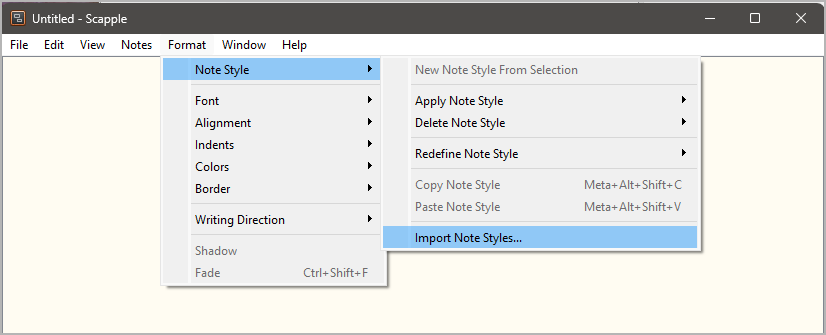
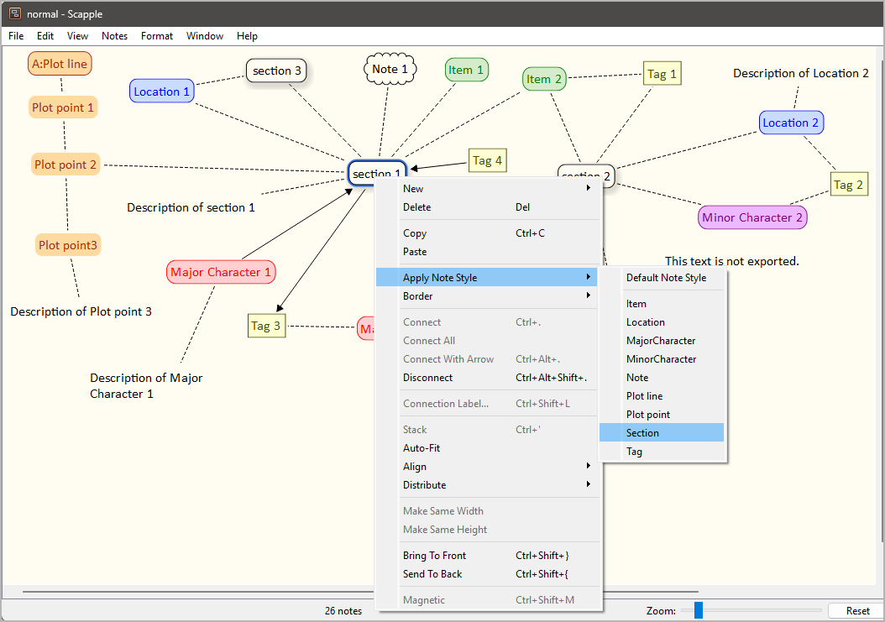
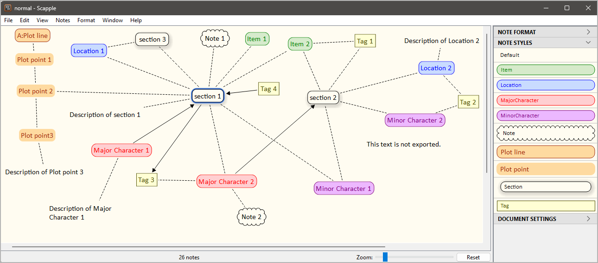

[Projekt-Homepage](https://github.com/peter88213/scap_novx) > [Index](../) > Help

[English](../help/)

------------------------------------------------------------------------

# scap_novx Benutzerhandbuch

Diese Seite gilt für die neueste Ausgabe von
[scap_novx](https://github.com/peter88213/scap_novx/).

Das Python-Skript *scap_novx.py* erzeugt ein *novelibre*-Projekt aus
einer *Scapple*-Gliederung.

## Gebrauchsanweisung

### Vorgesehene Benutzung

Das Installationsprogramm fordert Sie auf, eine Verknüpfung auf dem
Desktop anzulegen. Die können das Programm dann aufrufen, indem Sie mit
der Maus eine *.scap*-Datei auf das Symbol ziehen.

### Auf der Kommandozeile

Wahlweise können Sie auch

-   das Programm von der Kommandozeile aus aufrufen und die
    *Scapple*-Datei als Parameter übergeben, oder
-   das Programm aus einer Batchdatei heraus aufrufen.

Aufruf: `scap_novx.py [--silent] Quelldatei`

#### Positionsbezogene Parameter:

`Quelldatei`

Der Dateipfad der *Scapple*-Gliederungsdatei.

#### Optionale Parameter:

`--silent` Fehlermeldungen und Nachfragen unterdrücken.

## Funktionsweise

*scap_novx* erzeugt eine neue *novelibre*-Projektdatei im selben
Verzeichnis und mit dem selben Namen wie die Scapple-Quelldatei, doch
mit der Erweiterung [.novx]{.title-ref}\`.

---

***Anmerkung***

Falls das *novelibre*-Projekt bereits existiert, wird es nicht
überschrieben. Stattdessen werden XML-Figuren-, Schauplatz- und
Gegenstandsdateien erzeugt, die in jedes *novelibre*-Projekt importiert
werden können.

---

## Konvertierungsregeln

-   Notizen mit einem Schatten werden zu Abschnitten konvertiert.
-   Abschnitte werden nach ihrer Anordnung im Scapple-Diagramm sortiert
    (von oben links nach unten rechts).
-   Umrandete Notizen mit braunem Text werden zu Plotlinien konvertiert
    Sie können dem Titel einen durch einen Doppelpunkt abgetrennten
    Kurznamen voranstellen.
-   Notizen ohne Rand mit braunem Text werden zu Plotpunkten
    konvertiert.
-   Notizen mit rotem Text werden zu Hauptfiguren konvertiert.
-   Notizen mit violettem Text werden zu Nebenfiguren konvertiert.
-   Notizen mit blauem Text werden zu Schauplätzen konvertiert.
-   Notizen mit grünem Text werden zu Gegenständen konvertiert.
-   Weisen Sie Figuren, Schauplätze und Gegenstände einem Abschnitt zu,
    indem Sie die entsprechenden Notizen verbinden.
-   Weisen Sie Schlagwörter Abschnitten, Figuren, Schauplätzen und
    Gegenständen zu, indem Sie die entsprechenden Notizen verbinden.
-   Weisen Sie Perspektivfiguren Abschnitten zu, indem Sie Pfeile von
    der Figur zum Abschnitt erzeugen.
-   Weisen Sie Schlagwörter Abschnitten, Figuren, Schauplätzen und
    Gegenständen zu, indem Sie die entsprechenden Notizen verbinden.
-   Weisen Sie Abschnitte Plotlinien zu, indem sie sie entweder mit der
    Plotlinie oder mit einer ihrer Plotpunkte verbinden.
-   Weisen Sie Plotpunkte einem Abschnitt durch eine Verbindung zu.
-   Verbinden Sie den ersten Plotpunkt mit der Plotlinie, und verbinden
    Sie dann die folgenden Plotpunkte als Kette in fortlaufender
    Reihenfolge.
-   Notizen mit einem "Wolken"-Rand und ohne Schatten werden zu
    Elementnotizen konvertiert.
-   Notizen mit einem eckigen Rand und ohne Schatten werden zu
    Schlagwörtern konvertiert.
-   Einfache Notizen werden in Beschreibungen der Elemente konvertiert,
    mit denen sie verbunden sind.

## Wie man Einträge für den Export kennzeichnet

### Stile importieren

Zusammen mit der *scap_novx*-Distribution wird ein
*Scapple*-Beispielprojekt namens *styles.scap* geliefert, das alle
erforderlichen Formate enthält. Sie finden dieses Beispielprojekt im
*novelibre*-Installationsverzeichnis unter

`c:\Users\<Benutzername>\.novx\scap_novx\sample\`

Sie können entweder dieses Diagramm als Vorlage verwenden, oder dessen
Formate in Ihr eigenes Diagramm importieren.



Wählen Sie im Dateiauswahldialog
`c:\Users\<Benutzername>\.novx\scap_novx\sample\styles.scap`. Dann
können Sie die Formate per Kontextmenü zuweisen:



Sie können die Formate auch über den Inspector zuweisen:



### Abschnitte kennzeichnen

Wenden Sie das **Section**-Format per Kontextmenü oder Inspector an.

### Plotlinien kennzeichnen

Wenden Sie das **Plot line**-Format per Kontextmenü oder Inspector an.

### Plotpunkte kennzeichnen

Wenden Sie das **Plot point**-Format per Kontextmenü oder Inspector an.

### novelibre-Notizen kennzeichnen

Wenden Sie das **Note**-Format per Kontextmenü oder Inspector an.

### Schlagwörter kennzeichnen

Wenden Sie das **Tag**-Format per Kontextmenü oder Inspector an.

### Schauplätze kennzeichnen

Wenden Sie das **Location**-Format per Kontextmenü oder Inspector an.

### Hauptfiguren kennzeichnen

Wenden Sie das **MajorCharacter**-Format per Kontextmenü oder Inspector
an.

### Nebenfiguren kennzeichnen

Wenden Sie das **MinorCharacter**-Format per Kontextmenü oder Inspector
an.

### Gegenstände kennzeichnen

Wenden Sie das **Item**-Format per Kontextmenü oder Inspector an.

## Benutzerdefinierte Konfiguration

Sie können die Voreinstellungen mit Hilfe einer Konfigurationsdatei
überschreiben. Denken Sie aber immer daran, dass fehlerhafte Einträge
den Programmablauf stören können.

### Globale Konfiguration

Sie können eine optionale globale Konfigurationsdatei namens
`scap_novx.ini` im Konfigurationsverzeichnis der Installation ablegen.
Sie wird auf jedes Projekt angewendet. Ihre Einträge überschreiben die
Voreinstellungen von *nv_aeon2*. Dies ist der Pfad unter Windows:
`c:\Users\<Benutzername>\.novx\scap_novx\scap_novx.ini`

### Lokale Projektkonfiguration

Sie können eine optionale Projekt-Konfigurationsdatei namens
`scap_novx.ini` in Ihrem Projektverzeichnis ablegen, d.h. in dem Ordner,
der Ihre *novelibre*- und *Scapple*-Projektdateien enthält. Sie gilt
dann nur für das Projekt. Ihre Einträge überschreiben sowohl die
Voreinstellungen von *scap_novx* als auch die globale Konfiguration,
falls vorhanden.

### Wie man eine Konfigurationsdatei erstellt oder anpasst

Sie finden eine Musterkonfigurationsdatei mit den voreingestellten
Werten von *scap_novx* im *novelibre*-Installationsverzeichnis unter

`c:\Users\<Benutzername>\.novx\scap_novx\sample\`

Am besten erstellen Sie eine Kopie und bearbeiten sie.

-   Der Abschnitt SETTINGS bezieht sich hauptsächlich auf die Farben,
    d.h. auf die Textfarben, mit denen die Figuren, Schauplätze und
    Gegenstände in Scapple markieren. Wenn Sie sie ändern, kann sich das
    Programm anders verhalten anders verhalten als in der Beschreibung
    der Konvertierungsregeln weiter unten beschrieben.
-   Der Abschnitt OPTIONS umfasst Optionen für die reguläre
    Programmausführung.
-   Kommentarzeilen beginnen mit einem Rautenzeichen `#`. Im Beispiel
    beziehen sie sich auf die unmittelbar darüberliegende Codezeile.

Das ist die Konfigurationsdatei mit Erklärungen:

```ini

[SETTINGS]

location_color = 0.0 0.0 1.0

# RGB Textfarbe für Schauplätze in Scapple.

item_color = 0.0 0.5 0.0

# RGB Textfarbe für Gegenstände in Scapple.

major_chara_color = 1.0 0.0 0.0

# RGB Textfarbe für Hauptfiguren in Scapple.

minor_chara_color = 0.5 0.0 0.5

# RGB Textfarbe für Nebenfiguren in Scapple.

plot_line_color = 0.6 0.2 0.0

# RGB Textfarbe für Plotlinien und Plotpunkte in Scapple.

[OPTIONS]

export_sections = Yes

# Yes: Aus Scapple-Notizen Abschnitte erzeugen.

export_plot_lines = Yes

# Yes: Aus Scapple-Notizen Plotlinien und Plotpunkte erzeugen.

export_characters = Yes

# Yes: Aus Scapple-Notizen Figuren erzeugen.

export_locations = Yes

# Yes: Aus Scapple-Notizen Schauplätze erzeugen.

export_items = Yes

# Yes: Aus Scapple-Notizen Gegenstände erzeugen.

```

---

## Installationspfad

Das Setup-Skript kopiert *scap_novx.py* an einen definierten Ort. Unter
Windows ist das der folgende Ordner:

`c:\Users\<Benutzername>\.novx\scap_novx`
